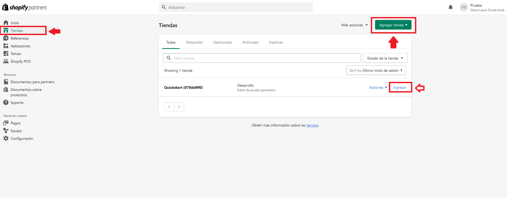
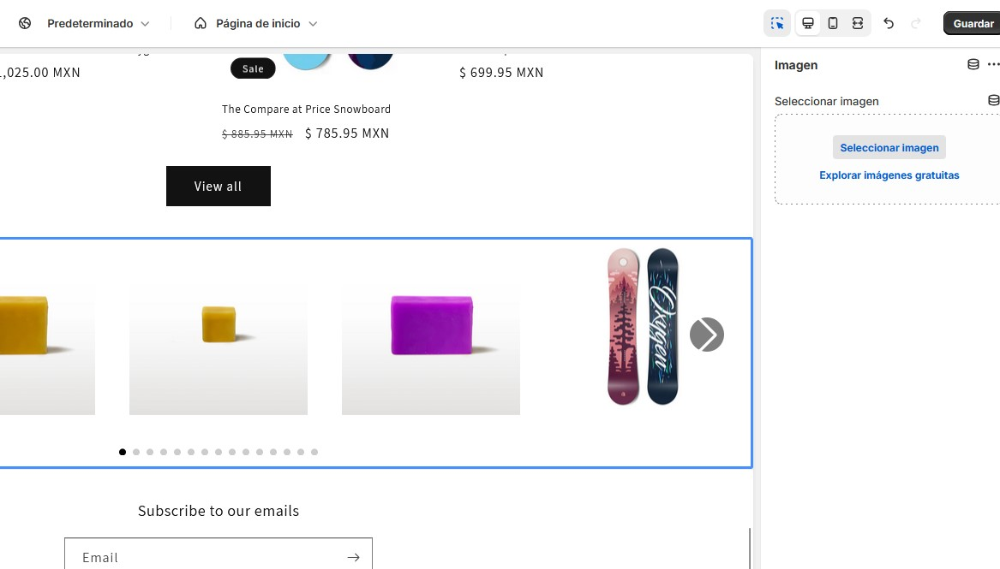
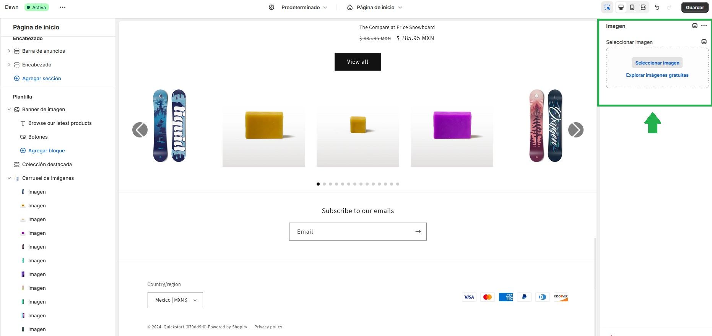
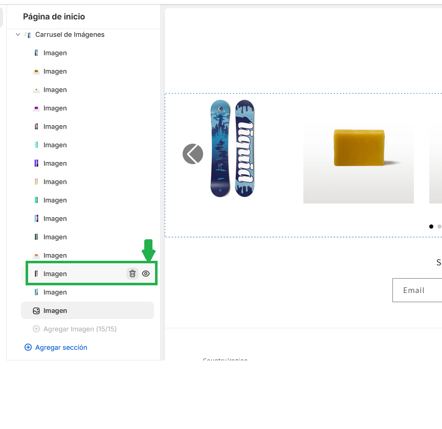
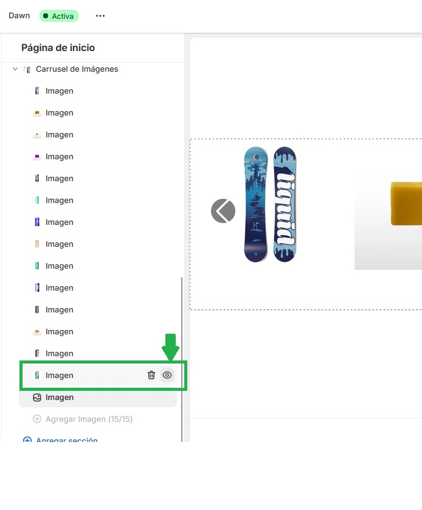
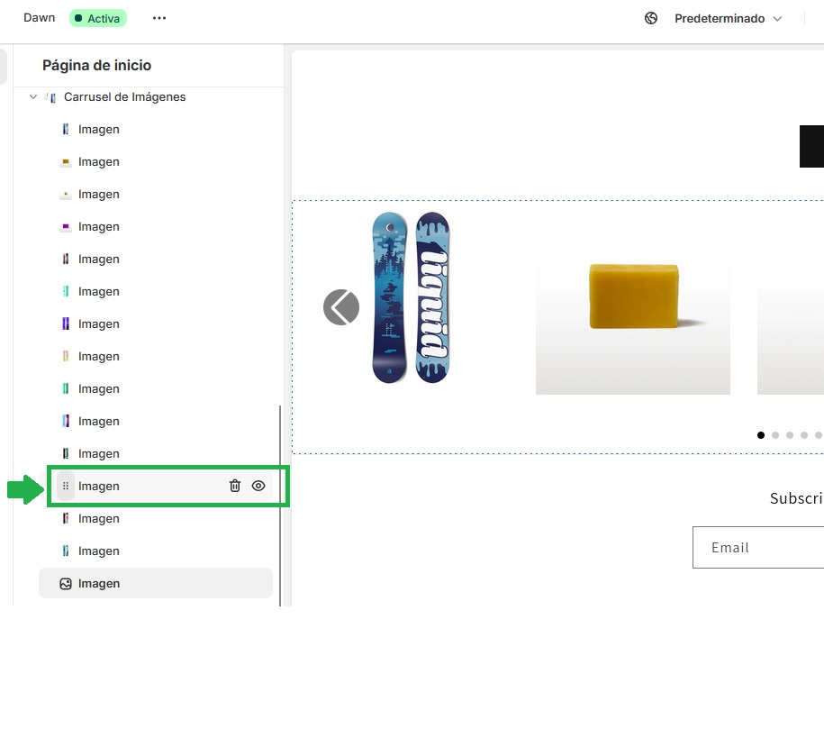
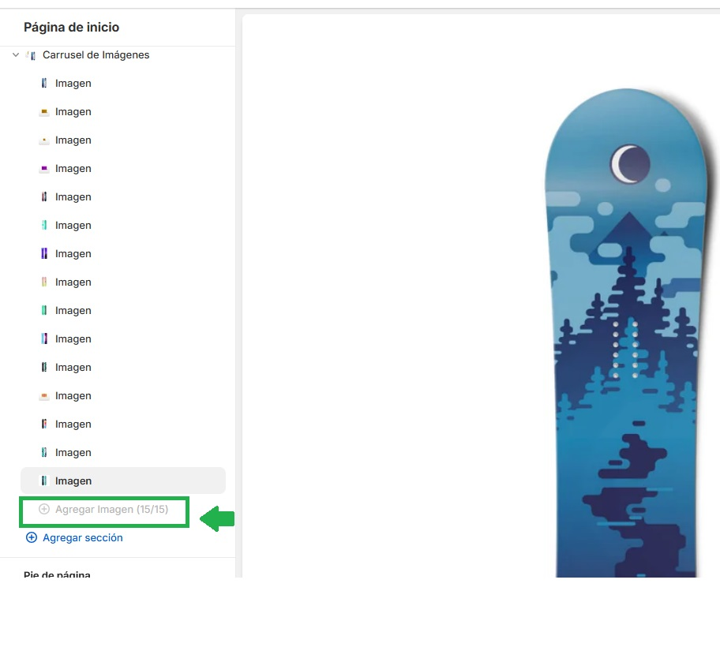
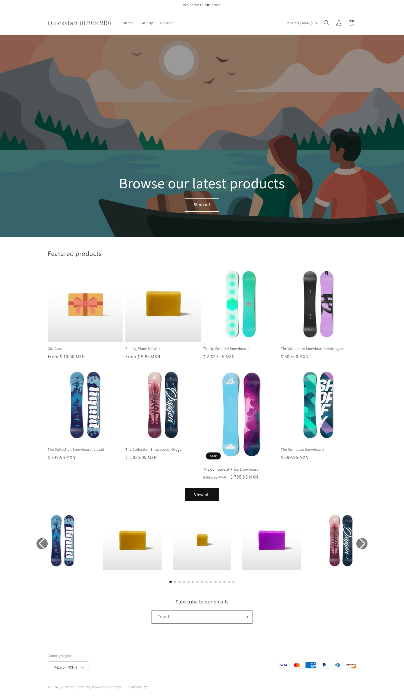
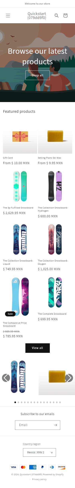
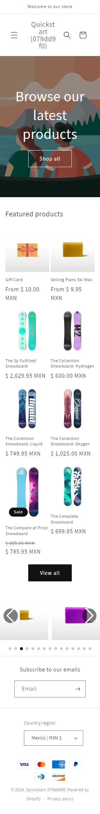

# Proyecto Shopify

Este proyecto es una tienda de Shopify con el tema **Dawn** versión 15.1.0.


## Descripción del proyecto
El proyecto es una tienda de  shopify, se hara uso de una plantilla a la cual se le agregara una nueva seccion personalizada de un carrousel para mostrar una serie de imagenes

## Objetivo a desarrollar del proyecto
- Crear un carrusel de imágenes (Máximo 15 imagenes)
- Hacer uso de Liquid para poder hacer la integración con Shopify
- Crear una nueva seccion con un carrusel de imagenes, este debe ser totalmente responsivo para celulares, tablets y navegadores.

## Shopify CLI

Es importante que tengamos **Shopify CLI** ya que es una herramienta que nos ayuda a agilizar lo que es el desarrollo dentro de la plataforma de Shopify, ayuda mucho a quienes trabajamos desde la consola para poder ver los cambios dentro de la página, en este caso yo lo descarque directo desde la página de Shopify en el apartado de Shopify CLI, en el siguiente enlace:

https://shopify.dev/docs/api/shopify-cli


Los comandos que utilicé fueron
```bash
npm install -g @shopify/cli@latest
```

y este otro comando para corroborar que ya estuviera instalado
```bash
shopify version
```

## Correr proyecto en local

1.- clonar el repositorio

```bash
git clone git@github.com:dianazavalaA/Shopify.git
```

2.- Correr el siguiente comando:
```bash
shopify theme dev -e development
```

3.- Para ver la tienda local:

http://127.0.0.1:9292

http://localhost:9292/

## Desarrollo

¿Qué se utilizó?
En este caso para el desarrollo del carrusel primero creamos la tienda en Shopify para después comenzar con la creación del carrusel.

Adjunto imagenes y descripción para la creación de la tienda en Shopify



Primero para esto ya debemos tener creada una cuenta de Shopify Partners, una vez dentro vamos al apartado **Tiendas** dentro de este, vamos al botón verde en la parte superior derecha que dice **"Agregar tienda"**


En la imagen anterior podemos ver que a momento de dar clic en el botón de **"Agregar tienda"** nos va a pedir si es para un cliente o para desarrollo nosotros vamos a poner que es para **Crear una tienda para probarla y desarrollarla** ya que vamos a descargar el código para poder agregar la sección, después vamos a poner el *Nombre de la tienda* aquí es lo que nosotros queramos ponerle o con lo que podamos identificarle mejor.
Luego nos pide **Versión de compilación** le vamos a poner la versión actual para poder probarla sin complicación.


Después vamos a continuar con **Datos y configuraciones** aquí le vamos a poner *empezar con una tienda vacia*, OJO puede ser con la de datos de prueba si es que ustedes quieren tener imagenes con datos de prueba lo que hace aquí es cargar información o imagenes de prueba dentro de la página de Shopify que acabamos de crear mientras que la vacía pues sólo carga los datos básicos de prueba.
Por último damos clic en el botón verde que esta en la parte de abajo que dice "Crear tienda en desarrollo"

Una vez hecho lo anterior volvemos a revisar la primera imagen que y vemos que hay unas letras que dicen *Ingresar* al darle clic ahí podemos tener acceso al paner de admin de la tienda de Shopify.

Así es como se va a ver el panel de admin una vez que se haya creado la tienda, justo como se muestra a continuación:


### Swiper.js

Antes de comenzar a explicar como funciona el archivo anterior, dejo la documentación de **Swiper** en la sección de articulos de apoyo, pero para adelantarles que existes 2 maneras en que se puede implementar esta librería las cuales son las siguientes:

1.- Instalarlo por medio de npm ```npm install swiper``` después importar **Swiper JS** y **Swiper Styles** en la documentación podemos ver todo a detalle.

2.- Utilizar Swiper desde CDN, esto para hacerlo más directo sin instalar dependencias, paquetes, etc. De igual formar todo viene a detalle en la documentación.

Yo opte por usar la opción número 2, ¿Por qué? para mi fue más fácil hacerlo desde CDN por el tiempo que se tiene para la entrega del ejercicio pero con cualquiera de las 2 formas debe funcionar perfectamente, ya dependerá de las condiciones del tiempo, gustos, proyecto, etc.

Ahora si a continuación la explicación detallada, yo en este caso trabaje 1 archivo que se encuentran dentro de */sections* que fue el siguiente:
- carousel.liquid

En la parte de **Swiper CSS** hice uso de Swiper.js, ya que investigando vi que es una librería justo para poder implementar y desarrollar carruseles, además de que ayuda a que sea responsivo. En la primera línea del código incluí esta librería.
Ahora en la parte de **Swiper Container** este es el código donde se desarrolla la parte del carrusel de imágenes utilizando Swiper, HTML y Liquid, en el primer div lo que hacemos es poner la clase de swiper que justamente esta engloba todas la reglas de estilo y page-width esta la puse ya que puede controlar el ancho del carrusel ya que sin esta las imagenes se ven muy grandes tanto que se puede perder la estetica.
El div que contiene swiper-container se uso para controlar las transiciones y también el comportamiento que tiene el carrusel.
Se uso swiper-wrapper para poder agrupar todas las imagenes que tenemos en el carrusel.

Ahora después de eso se hizo uso de Liquid donde hice uso de un ciclo for ¿por qué lo use? antes de comenzarlo a desarrollar analicé como podía ser el caso, en mi lógica estaba principalmente el hecho de hacer uso de este ciclo para poder recorrer todos los bloques que tuviera dicha sección, desglosaré la explicación de la línea `````` 
en lo anterior tenemos un tag de Liquid ```block.settings.image ``` el cual es un bloque en el editor que tenemos en el panel de admin de Shopify que se muestra a continuación



Cada que un usuario carga en este bloque una imagen se obtiene una URL de dicha imagen, lo que hace Shopify es utilizar dich URL para mostrarla del lado front, por lo que a esta misma le aplicamos un filter/filtro ```img_url: '1024x'``` con este filtro le estamos diciendo que Shopify deberá ajustar la imagen a un ancho de 1024 px, es decir, cualquier imagen que suba el usuario por medio del bloque le decimos a Shopify que deberá ajustar su tamaño para que tenga 1024 px de ancho y mantener su altura de manera proporcional.

En la parte de **Navigation buttons** lo que se hizo fue desarrollar o crear los botones de navegación tanto el prev como el next para que en el carrusel se vayan deslizando las imagenes de acuerdo a lo que el usuario desee con Swiper.js lo que se hizo fue poderle agregrar la parte interactiva.

En la parte de  **Pagination** esta parte se agrego para que se pueda ver más estetico al momento de ver la interacción entre el carrusel cuando pasaba de imagen que se viera en que parte se cambio.

En la parte de **Swiper JS** se esta cargando una versión que esta comprimida, de esta manera logra reducir su tamaño y mejorar el rendimiento al momento de que el página se cargue en el navegador, así mismo esta parte va de la mano con la parte de  **Swiper Initialization Script** donde hacemos uso de JavaScript en este inicializamos el carrusel ```var swiper = new Swiper``` creamos una nueva instancia de Swiper la cual esta conectada al contenedor HTML donde tenemos la estructura o maquetación que recordemos que tiene la clase ```swiper-container```, además se agrego un loop con true para que el carrusel sea infinito, es decir, una vez que lleguemos a la última imagen va a volver a comenzar para no tener fin.
Justo dentro de este habilitamos los botones de navegación para moverse entre diapositivas que podemos ver con las clases ```swiper-button-next``` y  ```swiper-button-prev```.
Habilitamos la paginación dentro de esta aquí usamos una propiedad ```clickable: true``` la cual permite que el usuario de la página haga clic en los puntos de la paginación para brincar entre las imagenes que tenemos en el carrusel.

El diseño responsivo se realizó con los breakpoints, los cuales logran adaptar el comportamiento del carrusel de acuerdo a los diferentes tamaños de pantalla, esta opción también la proporciona Swiper, en mobile se puso por default que en el carrusel se mostrara 1 imagen y en navegadores se puso por default mostrar 4 esto se puede cambiar justamente desde el código.

En la parte de  **Swiper Style** aquí es donde se concentra la mágia del CSS, aquí basicamente le damos estilo a las diapositivas que están dentro del carrusel, le damos estilo a los botones de prev y next, así como también a la paginación para que todo se ajuste y se luzca bien.


## Resultados obtenidos
Se logró desarrollar el carrusel de imagenes, adicional se logró tener el schema de manera visual con los bloques necesarios para poder cargar, eliminar y ocultar las imagenes, así como tener las opciones para elegir de cuantas columnas queremos ver las imagenes en el carrusel que va de 1 a 5 columnas para desktop y para mobile de 1 a 2.

A continuación se agregan un par de imagenes para poder ver como quedaron los resultados.

Seleccionar imagenes desde la parte del panel



Se puede eliminar la imagen desde el mismo panel



Se puede ocultar la imagen



Se puede reacomodar/reorganizar la imagen 



Al llegar a las 15 imagenes ya no se pueden cargar más



Ahora los resultados en las diferentes pantallas

Navegador MacBook Pro



iPhone SE



Galaxy S20 Plus


Galaxy Fold




## Articulos de Apoyo

https://shopify.dev/docs/


https://swiperjs.com/